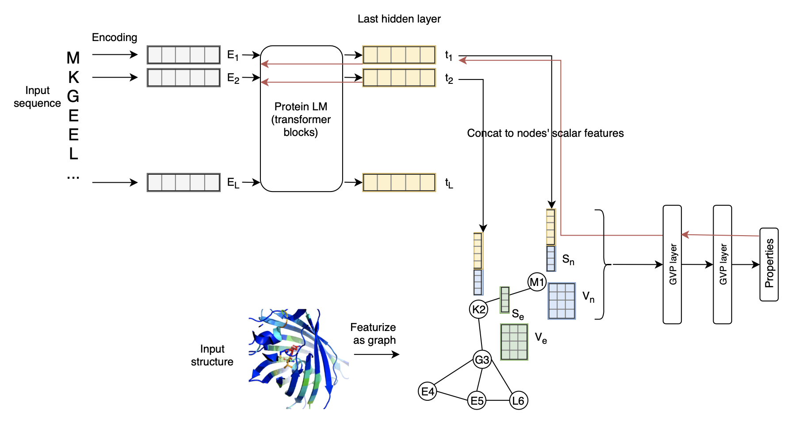

# LM-GVP: 

Source code for "LM-GVP: A Generalizable Deep Learning Framework for Protein Property Prediction from Sequence and Structure"


## Dependencies

LM-GVP experiments were performed in Python 3.6 with Pytorch (v1.8). 

To install all dependencies run:
```
$ pip install -r requirements.txt
```

## Training

Training of LM-GVP and competitive models for protein property predictions can be done in `train.py`, which utilizes the [PyTorch Lightning Trainer](https://pytorch-lightning.readthedocs.io/en/latest/common/trainer.html#). All of the [trainer flags](https://pytorch-lightning.readthedocs.io/en/latest/common/trainer.html#trainer-flags) in PyTorch Lightning are supported. To see the usage, run: 
```
$ python train.py -h

usage: train.py [-h] [--logger [LOGGER]] [--checkpoint_callback [CHECKPOINT_CALLBACK]] [--default_root_dir DEFAULT_ROOT_DIR] [--gradient_clip_val GRADIENT_CLIP_VAL] [--gradient_clip_algorithm GRADIENT_CLIP_ALGORITHM]
                [--process_position PROCESS_POSITION] [--num_nodes NUM_NODES] [--num_processes NUM_PROCESSES] [--gpus GPUS] [--auto_select_gpus [AUTO_SELECT_GPUS]] [--tpu_cores TPU_CORES] [--log_gpu_memory LOG_GPU_MEMORY]
                [--progress_bar_refresh_rate PROGRESS_BAR_REFRESH_RATE] [--overfit_batches OVERFIT_BATCHES] [--track_grad_norm TRACK_GRAD_NORM] [--check_val_every_n_epoch CHECK_VAL_EVERY_N_EPOCH] [--fast_dev_run [FAST_DEV_RUN]]
                [--accumulate_grad_batches ACCUMULATE_GRAD_BATCHES] [--max_epochs MAX_EPOCHS] [--min_epochs MIN_EPOCHS] [--max_steps MAX_STEPS] [--min_steps MIN_STEPS] [--max_time MAX_TIME] [--limit_train_batches LIMIT_TRAIN_BATCHES]
                [--limit_val_batches LIMIT_VAL_BATCHES] [--limit_test_batches LIMIT_TEST_BATCHES] [--limit_predict_batches LIMIT_PREDICT_BATCHES] [--val_check_interval VAL_CHECK_INTERVAL]
                [--flush_logs_every_n_steps FLUSH_LOGS_EVERY_N_STEPS] [--log_every_n_steps LOG_EVERY_N_STEPS] [--accelerator ACCELERATOR] [--sync_batchnorm [SYNC_BATCHNORM]] [--precision PRECISION] [--weights_summary WEIGHTS_SUMMARY]
                [--weights_save_path WEIGHTS_SAVE_PATH] [--num_sanity_val_steps NUM_SANITY_VAL_STEPS] [--truncated_bptt_steps TRUNCATED_BPTT_STEPS] [--resume_from_checkpoint RESUME_FROM_CHECKPOINT] [--profiler PROFILER]
                [--benchmark [BENCHMARK]] [--deterministic [DETERMINISTIC]] [--reload_dataloaders_every_epoch [RELOAD_DATALOADERS_EVERY_EPOCH]] [--auto_lr_find [AUTO_LR_FIND]] [--replace_sampler_ddp [REPLACE_SAMPLER_DDP]]
                [--terminate_on_nan [TERMINATE_ON_NAN]] [--auto_scale_batch_size [AUTO_SCALE_BATCH_SIZE]] [--prepare_data_per_node [PREPARE_DATA_PER_NODE]] [--plugins PLUGINS] [--amp_backend AMP_BACKEND] [--amp_level AMP_LEVEL]
                [--distributed_backend DISTRIBUTED_BACKEND] [--move_metrics_to_cpu [MOVE_METRICS_TO_CPU]] [--multiple_trainloader_mode MULTIPLE_TRAINLOADER_MODE] [--stochastic_weight_avg [STOCHASTIC_WEIGHT_AVG]]
                [--model_name MODEL_NAME] --task TASK [--pretrained_weights PRETRAINED_WEIGHTS] [--lr LR] [--bs BS] [--early_stopping_patience EARLY_STOPPING_PATIENCE] [--num_workers NUM_WORKERS]

optional arguments:
  -h, --help            show this help message and exit
  --model_name MODEL_NAME
                        Choose from gvp, bert, bert_gvp, gat, bert_gat
  --task TASK           Task to perform: ['flu', 'protease', 'cc', 'bp', 'mf']
  --pretrained_weights PRETRAINED_WEIGHTS
                        path to pretrained weights (such as GAE) to initialize model
  --lr LR               learning rate
  --bs BS               batch size
  --early_stopping_patience EARLY_STOPPING_PATIENCE
  --num_workers NUM_WORKERS
                        num_workers used in DataLoader

pl.Trainer:
  --logger [LOGGER]     Logger (or iterable collection of loggers) for experiment tracking. A ``True`` value uses the default ``TensorBoardLogger``. ``False`` will disable logging.
  # other pl.Trainer flags...
```
A recommended set of training flags with multi-GPU and mixed precision training is as follows:
```
$ python train.py \
    --task cc \
    --model_name bert_gvp \
    --freeze_bert True \
    --num_nodes 1 \
    --gpus 8 \
    --bs 4 \
    --lr 1e-4 \
    --max_epochs 200 \
    --early_stopping_patience 10 \
    --precision 16 \
    --accelerator ddp \
    --num_workers 32 
```

## Data preparation
Scripts and utilility functions used for preparing protein sequence and structure data are available in [data](data/). The python scripts parse PDB files to extract the coordinates of the 4 key atoms from amino acids to generate json records compatible to the LM-GVP and competitive models.

Datasets used in this study are from publicly available resources:
- [GO datasets](https://github.com/flatironinstitute/DeepFRI/tree/master/preprocessing/data)
- [TAPE](https://github.com/songlab-cal/tape) datasets:
  * Fluorescence: s3://songlabdata/proteindata/data_pytorch/fluorescence.tar.gz
  * Protease stability: s3://songlabdata/proteindata/data_pytorch/stability.tar.gz

## Model interpretation and mechanistic analyses

Codes and notebooks used for model analyses are available in the following directories:
- [Intepretation](interpretation/)
- [Zero-shot mutational effect prediction](zeroshot_mut/)
- [Contact-map prediction](contact_map/)

## Citation

Coming soon...

## Security

See [CONTRIBUTING](CONTRIBUTING.md#security-issue-notifications) for more information.

## License

This library is licensed under the MIT-0 License. See the LICENSE file.

